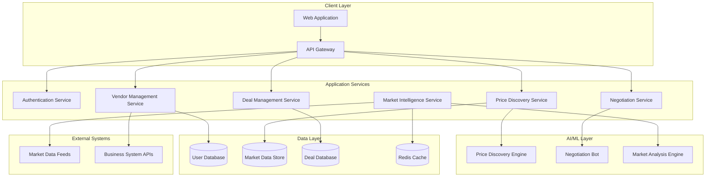

# Design Document: Vendor Price Platform

## Overview

The Vendor Price Platform is a cloud-native web application that provides local vendors with AI-powered price discovery and automated negotiation capabilities. The system leverages real-time market intelligence, machine learning algorithms, and autonomous negotiation agents to help vendors optimize their pricing strategies and secure better deals.

The platform follows a microservices architecture with event-driven communication, enabling real-time data processing and scalable AI operations. Key design principles include modularity, real-time responsiveness, data security, and seamless integration capabilities.

## Architecture

### High-Level Architecture

The system employs a microservices architecture with the following core components:



### Technology Stack

- **Frontend**: React.js with TypeScript for type safety and modern UI components
- **API Gateway**: Kong or AWS API Gateway for routing, authentication, and rate limiting
- **Backend Services**: Node.js with Express.js for rapid development and JavaScript ecosystem
- **AI/ML**: Python with TensorFlow/PyTorch for machine learning models, integrated via REST APIs
- **Databases**: PostgreSQL for transactional data, MongoDB for market data, Redis for caching
- **Message Queue**: Apache Kafka for event-driven communication and real-time data streaming
- **Infrastructure**: Docker containers orchestrated with Kubernetes for scalability

## Components and Interfaces

### Authentication Service

**Responsibilities:**
- Multi-factor authentication and session management
- Role-based access control (RBAC)
- JWT token generation and validation
- Integration with external identity providers

**Key Interfaces:**
```typescript
interface AuthService {
  authenticate(credentials: LoginCredentials): Promise<AuthToken>
  validateToken(token: string): Promise<UserSession>
  refreshToken(refreshToken: string): Promise<AuthToken>
  logout(token: string): Promise<void>
}
```

### Vendor Management Service

**Responsibilities:**
- Vendor profile creation and management
- Business information validation
- Preference and configuration management
- Integration with external business systems

**Key Interfaces:**
```typescript
interface VendorService {
  createProfile(vendorData: VendorRegistration): Promise<VendorProfile>
  updateProfile(vendorId: string, updates: ProfileUpdate): Promise<VendorProfile>
  getProfile(vendorId: string): Promise<VendorProfile>
  validateBusinessInfo(businessData: BusinessInfo): Promise<ValidationResult>
}
```

### Price Discovery Service

**Responsibilities:**
- Coordinate with AI engine for price analysis within 3-second response time requirement
- Cache and serve pricing recommendations with confidence indicators
- Track pricing history and trends
- Manage pricing alert subscriptions with customizable thresholds
- Handle insufficient data scenarios with appropriate fallbacks

**Key Interfaces:**
```typescript
interface PriceDiscoveryService {
  getPriceRecommendation(request: PriceRequest): Promise<PriceRecommendation>
  subscribeToPriceAlerts(vendorId: string, criteria: AlertCriteria): Promise<Subscription>
  getPricingHistory(productId: string, timeRange: TimeRange): Promise<PriceHistory>
  updateAlertPreferences(vendorId: string, preferences: AlertPreferences): Promise<void>
  validateDataSufficiency(request: PriceRequest): Promise<DataSufficiencyReport>
}
```

### Negotiation Service

**Responsibilities:**
- Orchestrate AI-powered negotiations
- Manage negotiation sessions and state
- Apply vendor-defined constraints and preferences
- Provide negotiation analytics and reporting

**Key Interfaces:**
```typescript
interface NegotiationService {
  initiateNegotiation(request: NegotiationRequest): Promise<NegotiationSession>
  processCounterproposal(sessionId: string, proposal: Proposal): Promise<NegotiationResponse>
  pauseNegotiation(sessionId: string, reason: string): Promise<void>
  getNegotiationHistory(vendorId: string): Promise<NegotiationHistory[]>
}
```

### Market Intelligence Service

**Responsibilities:**
- Aggregate data from multiple market sources
- Process and normalize market data
- Generate market trend analysis
- Distribute real-time market alerts

**Key Interfaces:**
```typescript
interface MarketIntelligenceService {
  getMarketData(query: MarketQuery): Promise<MarketData>
  subscribeToMarketUpdates(criteria: MarketCriteria): Promise<Subscription>
  generateTrendAnalysis(parameters: AnalysisParameters): Promise<TrendReport>
}
```

### Deal Management Service

**Responsibilities:**
- Track deal lifecycle and status with version history
- Calculate performance metrics including savings and success rates
- Manage deal documentation and history with searchable metadata
- Generate reports and analytics
- Send automated deadline reminders
- Archive completed deals with comprehensive metadata

**Key Interfaces:**
```typescript
interface DealManagementService {
  createDeal(dealData: DealCreation): Promise<Deal>
  updateDealStatus(dealId: string, status: DealStatus): Promise<Deal>
  getDealMetrics(vendorId: string, timeRange: TimeRange): Promise<DealMetrics>
  exportDeals(vendorId: string, format: ExportFormat): Promise<ExportResult>
  scheduleDeadlineReminder(dealId: string, reminderTime: Date): Promise<void>
  archiveDeal(dealId: string, metadata: DealMetadata): Promise<ArchivedDeal>
  searchDeals(vendorId: string, criteria: SearchCriteria): Promise<Deal[]>
}
```

### Integration Service

**Responsibilities:**
- Provide REST API endpoints for external business system integration
- Validate and process external data imports
- Maintain data synchronization with connected systems
- Handle integration errors and logging
- Support standard data export formats

**Key Interfaces:**
```typescript
interface IntegrationService {
  validateImportData(data: any, format: ImportFormat): Promise<ValidationResult>
  importBusinessData(vendorId: string, data: ImportData): Promise<ImportResult>
  exportData(vendorId: string, format: ExportFormat, criteria: ExportCriteria): Promise<ExportResult>
  syncWithExternalSystem(vendorId: string, systemId: string): Promise<SyncResult>
  getIntegrationStatus(vendorId: string): Promise<IntegrationStatus[]>
}
```

## Data Models

### Core Entities

```typescript
interface VendorProfile {
  id: string
  businessName: string
  businessType: BusinessType
  location: Location
  contactInfo: ContactInfo
  preferences: VendorPreferences
  verificationStatus: VerificationStatus
  createdAt: Date
  updatedAt: Date
}

interface PriceRecommendation {
  productId: string
  recommendedPrice: Price
  priceRange: PriceRange
  confidence: number
  marketFactors: MarketFactor[]
  competitorPrices: CompetitorPrice[]
  timestamp: Date
  expiresAt: Date
}

interface NegotiationSession {
  id: string
  vendorId: string
  counterpartyId: string
  productId: string
  status: NegotiationStatus
  currentProposal: Proposal
  negotiationHistory: NegotiationStep[]
  constraints: NegotiationConstraints
  startedAt: Date
  lastActivity: Date
}

interface Deal {
  id: string
  vendorId: string
  counterpartyId: string
  productId: string
  finalPrice: Price
  terms: DealTerms
  status: DealStatus
  negotiationSessionId?: string
  performanceMetrics: DealMetrics
  createdAt: Date
  completedAt?: Date
}

interface MarketData {
  productCategory: string
  region: string
  averagePrice: Price
  priceRange: PriceRange
  demandLevel: DemandLevel
  trends: TrendData[]
  lastUpdated: Date
  sources: DataSource[]
}
```

### Supporting Types

```typescript
type BusinessType = 'retail' | 'wholesale' | 'service' | 'manufacturing' | 'other'
type NegotiationStatus = 'active' | 'paused' | 'completed' | 'cancelled'
type DealStatus = 'pending' | 'active' | 'completed' | 'cancelled'
type DemandLevel = 'low' | 'medium' | 'high' | 'very_high'

interface Price {
  amount: number
  currency: string
}

interface Location {
  address: string
  city: string
  state: string
  country: string
  coordinates?: Coordinates
}

interface NegotiationConstraints {
  minPrice?: Price
  maxPrice?: Price
  maxRounds: number
  timeLimit: number
  autoApproveThreshold?: Price
}
```

## Correctness Properties

*A property is a characteristic or behavior that should hold true across all valid executions of a system—essentially, a formal statement about what the system should do. Properties serve as the bridge between human-readable specifications and machine-verifiable correctness guarantees.*

### Property 1: Vendor Registration Round Trip
*For any* valid business information provided during registration, the system should create a vendor profile that contains all the submitted data and can be retrieved with identical information.
**Validates: Requirements 1.1, 1.2**

### Property 2: Input Validation Consistency  
*For any* incomplete or invalid data (missing required fields, invalid formats), the system should reject the input and provide clear validation error messages.
**Validates: Requirements 1.3, 6.2**

### Property 3: Authentication and Authorization Enforcement
*For any* user access attempt, the system should require valid multi-factor authentication and enforce role-based permissions for all data access.
**Validates: Requirements 1.4, 7.2, 7.3**

### Property 4: Price Discovery Performance and Accuracy
*For any* product pricing request, the system should return competitive price recommendations within 3 seconds that incorporate location, business size, and historical data factors.
**Validates: Requirements 2.1, 2.3**

### Property 5: Market Intelligence Completeness
*For any* market intelligence request, the response should include pricing trends, demand patterns, timestamps, and source attribution with all required data elements present.
**Validates: Requirements 2.5, 4.3, 4.4**

### Property 6: Price Alert Responsiveness
*For any* significant market price change, the system should generate and deliver price alerts to subscribed vendors within 5 minutes.
**Validates: Requirements 2.2, 4.2**

### Property 7: Negotiation Constraint Adherence
*For any* negotiation session, the AI bot should never exceed vendor-defined parameters (price limits, time limits, round limits) without explicit vendor approval.
**Validates: Requirements 3.3, 3.4**

### Property 8: Negotiation Context Analysis
*For any* negotiation initiation or counterproposal, the AI bot should generate responses that appropriately consider market data, vendor preferences, and negotiation history.
**Validates: Requirements 3.1, 3.2**

### Property 9: Comprehensive Audit Trail
*For any* system operation (deal creation, profile updates, data access), the system should record complete audit logs with timestamps, user identification, and change details.
**Validates: Requirements 3.5, 5.1, 7.4**

### Property 10: Deal Performance Metrics Accuracy
*For any* completed deal, the system should calculate performance metrics (savings, success rates) that accurately reflect the negotiation outcomes and historical comparisons.
**Validates: Requirements 5.4**

### Property 11: Data Export Format Compliance
*For any* export request, the system should generate files in the requested format (CSV, PDF, JSON) that contain complete data and conform to standard format specifications.
**Validates: Requirements 6.3**

### Property 12: Security and Encryption Enforcement
*For any* sensitive data operation, the system should apply industry-standard encryption for data in transit and at rest, and maintain secure data handling throughout.
**Validates: Requirements 7.1**

### Property 13: System Performance Under Load
*For any* standard user operation under normal system load, the response time should not exceed 2 seconds, and the system should handle concurrent users up to specified capacity.
**Validates: Requirements 8.1, 8.2**

### Property 14: Alert Customization Persistence
*For any* vendor alert preference configuration, the system should save the settings and apply them consistently to future market events matching the criteria.
**Validates: Requirements 4.5**

### Property 15: Integration API Functionality
*For any* valid API request to integration endpoints, the system should process the request correctly and return appropriate responses in the expected format.
**Validates: Requirements 6.1**

## Error Handling

### Error Categories and Strategies

**Input Validation Errors:**
- Invalid business registration data → Return structured validation errors with field-specific messages
- Malformed API requests → Return HTTP 400 with detailed error descriptions
- Authentication failures → Return HTTP 401 with secure error messages (no sensitive info leakage)

**System Integration Errors:**
- External market data feed failures → Graceful degradation using cached data with staleness indicators
- AI service unavailability → Queue requests for retry with exponential backoff
- Database connection issues → Circuit breaker pattern with fallback to read replicas

**Business Logic Errors:**
- Negotiation constraint violations → Pause negotiation and request vendor intervention
- Insufficient market data → Provide best-effort estimates with confidence indicators
- Deal processing failures → Rollback transactions and notify relevant parties

**Performance and Capacity Errors:**
- Rate limit exceeded → Return HTTP 429 with retry-after headers
- System overload → Load balancing with graceful service degradation
- Timeout errors → Async processing with status polling endpoints

### Error Response Format

```typescript
interface ErrorResponse {
  error: {
    code: string
    message: string
    details?: Record<string, any>
    timestamp: string
    requestId: string
  }
}
```

### Monitoring and Alerting

- Real-time error rate monitoring with automated alerts
- Performance degradation detection and auto-scaling triggers  
- Security incident detection and immediate notification
- Business metric anomaly detection (unusual negotiation patterns, pricing outliers)

## Testing Strategy

### Dual Testing Approach

The testing strategy employs both unit testing and property-based testing as complementary approaches:

**Unit Tests** focus on:
- Specific examples and edge cases
- Integration points between services
- Error condition handling
- API contract validation

**Property-Based Tests** focus on:
- Universal properties that hold across all inputs
- Comprehensive input coverage through randomization
- Correctness validation for business logic
- Performance characteristics under varied conditions

### Property-Based Testing Configuration

**Framework Selection:** 
- **JavaScript/TypeScript**: fast-check library for frontend and API services
- **Python**: Hypothesis library for AI/ML components

**Test Configuration:**
- Minimum 100 iterations per property test to ensure statistical confidence
- Each property test references its corresponding design document property
- Tag format: **Feature: vendor-price-platform, Property {number}: {property_text}**

**Property Test Examples:**

```typescript
// Property 1: Vendor Registration Round Trip
test('Feature: vendor-price-platform, Property 1: Vendor Registration Round Trip', () => {
  fc.assert(fc.property(
    vendorRegistrationArbitrary(),
    (registrationData) => {
      const profile = cr